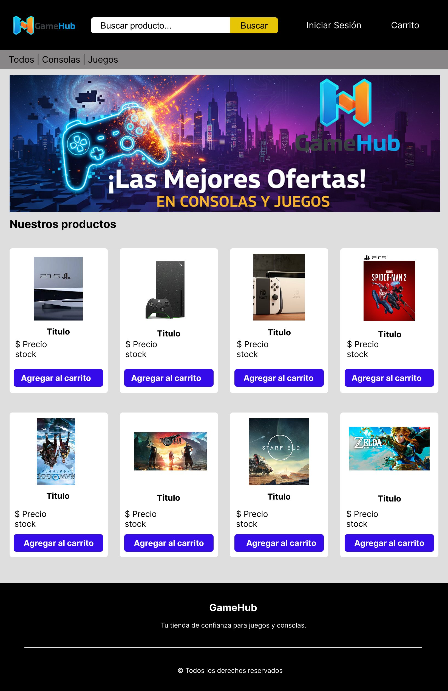
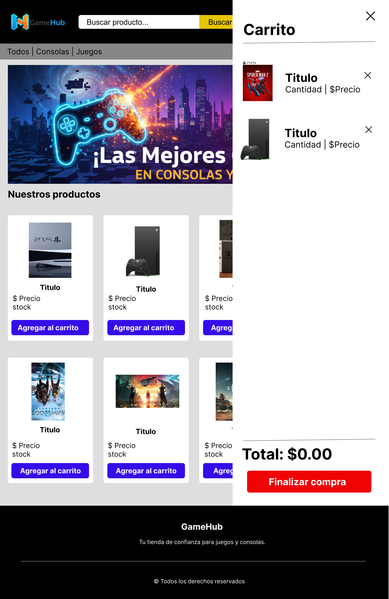
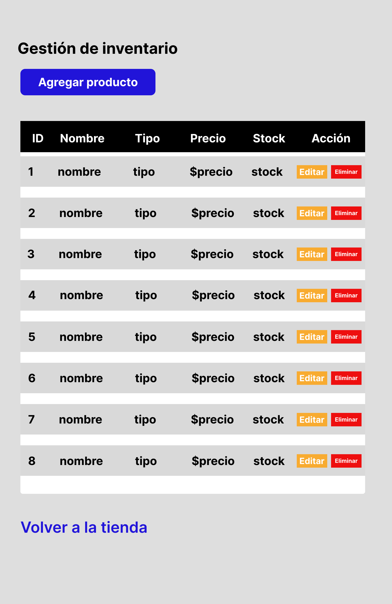

# 🎮 GameHub - Tienda de Videojuegos

## 📘 Visión General del Proyecto
**GameHub** es un proyecto de comercio electrónico **Full Stack** interactivo y responsivo, diseñado para un taller académico.  
Simula las funcionalidades de una tienda en línea de videojuegos, incluyendo la visualización de productos, un carrito de compras dinámico, autenticación de usuarios con roles, y un historial de pedidos por cliente.

El objetivo principal fue desarrollar una aplicación completa desde cero, con un **backend** en **Node.js (Express)** que gestiona la lógica de negocio y la persistencia de datos en **MongoDB**, y un **frontend** con **HTML**, **CSS (Tailwind)** y **JavaScript puro** que consume la API creada, enfocándose en la modularidad, interactividad y una excelente experiencia de usuario.

---

## ✨ Características Principales

### 🕹️ Catálogo de Productos Dinámico
- Carga de productos desde la API propia, con imágenes, precios en Pesos Colombianos (COP) y stock en tiempo real.

### 🔍 Filtrado y Búsqueda Interactivo
- Filtrado de productos por categorías (juego, consola).  
- Funcionalidad de búsqueda en tiempo real por nombre del producto.

### 🛒 Carrito de Compras Funcional
- Agregar, modificar y eliminar productos del carrito.  
- Actualización en tiempo real del contador de artículos y el total del carrito.

### 🔐 Sistema de Autenticación y Roles
- Modal de login y registro con persistencia de usuarios en MongoDB.  
- La interfaz se adapta según el rol del usuario (cliente o admin).  
- Cambio dinámico del estado de "Cuenta" a "Cerrar sesión" cuando el usuario está autenticado.

### 📜 Historial de Pedidos (Mis Pedidos)
- Sección exclusiva para usuarios logueados que muestra su historial de compras.  
- Visualización detallada de cada pedido con un diseño de acordeón.

### 🧑‍💻 Panel de Administración (CRUD)
- Página protegida y accesible solo para usuarios con rol de admin.  
- Permite **Crear**, **Leer**, **Actualizar** y **Eliminar** productos del inventario de la tienda.

### 📱 Diseño Responsivo y Moderno
- Adaptabilidad a diferentes tamaños de pantalla (móvil, tablet, escritorio).  
- Notificaciones "Toast" para un feedback de usuario claro y no intrusivo.

---

## 🛠️ Tecnologías Utilizadas

### Backend
- **Node.js y Express:** Para construir la API RESTful.  
- **MongoDB (Driver Oficial):** Como base de datos NoSQL para la persistencia de datos.  
- **Dotenv:** Para la gestión de variables de entorno.  
- **Express-validator:** Para la validación de los datos de entrada.  
- **CORS:** Para permitir la comunicación segura entre el backend y el frontend.

### Frontend
- **HTML5:** Estructura semántica del contenido.  
- **Tailwind CSS:** Framework CSS para un desarrollo rápido y un diseño responsivo.  
- **JavaScript (ES Modules):** Lógica interactiva, modularización y manipulación del DOM.  
- **Phosphor Icons:** Para los iconos de la interfaz de usuario.

---

## 🎨 Maquetación y Diseño (Figma)

El diseño de la interfaz de usuario de **GameHub** fue creado en **Figma**, siguiendo principios de diseño moderno y enfocado en la experiencia de compra de productos de gaming.

**Pantalla principal:**  
  

**Carrito de compras:**  


**Panel Administrativo:**  


🔗 **Link de Figma:** [Ver diseño completo en Figma](https://www.figma.com/proto/q08CzzxRGp3ebidQS9mjQd/GAMEHUB?node-id=0-1&t=0bPZJ1ZhvCWM1KNa-1)

---

## 🚀 Cómo Ejecutar el Proyecto

Este es un proyecto **Full Stack** y requiere que tanto el backend como el frontend estén en ejecución.

### 1️⃣ Ejecutar el Backend

Clona el repositorio del backend:

```bash
git clone https://github.com/BryanVillabona/GameHub-Backend.git
```

Navega al directorio del backend e instala las dependencias:

```bash
cd GameHub-Backend
npm install
```

Configura tus variables de entorno creando un archivo `.env` en la raíz del proyecto.

Puebla la base de datos con el catálogo y el usuario administrador:

```bash
npm run seed
```

Inicia el servidor del backend:

```bash
npm run dev
```

El servidor estará escuchando en:  
👉 **http://localhost:4000**

---

### 2️⃣ Ejecutar el Frontend

Clona este repositorio (frontend).

```bash
git clone https://github.com/BryanVillabona/GameHub-Frontend.git
```

Navega al directorio del frontend:

```bash
cd GameHub-Frontend
```

Abre el archivo `index.html` en tu navegador web.  
Se recomienda usar una extensión como **Live Server** en Visual Studio Code para un desarrollo más fluido.

⚠️ **Importante:**  
El frontend no funcionará si el servidor del backend no está en ejecución.

---

## 📁 Estructura de Archivos

### 🗂️ Estructura del Backend
```
backend/
├── src/
│   ├── config/
│   ├── controllers/
│   ├── dtos/
│   ├── middlewares/
│   ├── routers/
│   ├── services/
│   ├── seed.js
│   └── server.js
└── ...
```

### 🗂️ Estructura del Frontend
```
frontend/
├── index.html
├── admin.html
├── css/
│   └── styles.css
└── js/
    ├── api.js       # Centraliza las llamadas a la API
    ├── ui.js        # Maneja la manipulación del DOM
    ├── main.js      # Lógica para index.html
    └── admin.js     # Lógica para admin.html
```

---

## 🔗 Repositorio del Backend

El backend de esta aplicación, desarrollado con **Node.js** y **Express** se encuentra en el siguiente repositorio:

> [▶️ **Ver Repositorio del Backend**](https://github.com/BryanVillabona/GameHub-Backend.git)

---

## 👤 Integrantes

| Nombre Completo        | Rol         |
|-------------------------|-------------|
| Bryan Villabona             | Estudiante  |
| Sergio Lievano  | Estudiante  |

---

## 🙌 Agradecimientos
- **Tailwind CSS**  
- **Phosphor Icons**
